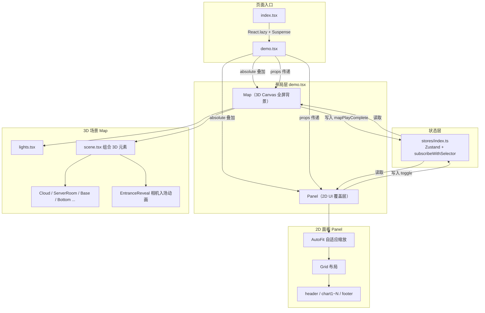

# AI Context — sc-datav

> **给 AI 代理的速览手册**。读完本文即可理解项目全貌、做决策和写代码。只有需要抠实现细节时才去翻对应源码。
>
> 最后更新：2026-05-25 | 触发更新：新增页面、架构变更、新增通用组件

---

## 0. AI 行为规则

- **路线图管理**：当用户提出新功能想法、改进建议或报告任务完成时，**建议用户切换到 Roadmap agent** 来记录。Roadmap agent 定义在 `.github/agents/roadmap.agent.md`，它维护 `ROADMAP.md`。
- **不要手动编辑 ROADMAP.md**：让 Roadmap agent 来做，它知道格式和去重规则。
- **编码前先查路线图**：接手新任务时，快速扫一眼 `ROADMAP.md` 看看有没有相关的计划或依赖。

---

## 1. 项目身份

基于 **Three.js + React 19 + ECharts** 的 3D 数据可视化大屏项目。原仓库包含 4 个 Demo 展示不同 3D 地图效果，当前在 DataCenter 页面进行功能开发和组件解耦实验。

| 类别 | 技术 |
|------|------|
| 框架 | React 19.1 + TypeScript 5.9 |
| 构建 | Vite 8（Rolldown），`base: "/sc-datav/"` |
| 3D 渲染 | Three.js 0.183 + @react-three/fiber 9.4 + @react-three/drei 10.7 |
| 后处理 | @react-three/postprocessing 3.0（Bloom、ToneMapping） |
| 图表 | ECharts 6.0（按需引入，非全量导入） |
| 状态管理 | Zustand 5.0 + subscribeWithSelector 中间件 |
| 动画 | GSAP 3.13 |
| 样式 | styled-components 6.1 + CSS 自定义属性 |
| 地理数据 | d3-geo 3.1 + topojson-client 3.0 |
| 自适应 | autofit.js 3.2（大屏分辨率适配） |
| 调试 | leva 0.10（运行时参数面板） |
| 热力图 | keli-heatmap.js 2.0 |
| 路由 | react-router 7.9（HashRouter，兼容 GitHub Pages） |

---

## 2. 架构模式

每个页面遵循同一套 **Scene-Panel-Store 双层解耦架构**：



**关键规则**：
- `demo.tsx` 是唯一的组装点——它决定 Map 和 Panel 如何叠加、传递什么 props
- Store 是 Map ↔ Panel 的唯一通信通道，不直接互相引用
- `mapPlayComplete` 是约定信号：3D 入场动画完成后设为 `true`，Panel 据此触发自己的入场动画

---

## 3. 目录地图

```
sc-datav/
├── AI_CONTEXT.md              ← 本文件
├── package.json                ← 依赖清单（pnpm）
├── vite.config.ts              ← @/ 别名 = src/，base = /sc-datav/
├── tsconfig.app.json           ← strict，verbatimModuleSyntax
├── public/
│   ├── font/pmzd.woff2         ← 唯一自定义字体
│   ├── hdr/venice_sunset_1k.hdr ← Demo3 环境贴图
│   └── model/glb/
│       ├── server_room.glb     ← DataCenter 机房模型
│       └── turbine.glb         ← Demo3 涡轮机模型
├── scripts/
│   └── printModelTree.mjs      ← 解析 GLB 节点树的工具脚本
├── src/
│   ├── App.tsx                 ← 路由注册 + GSAP 页面切换动画
│   ├── main.tsx                ← StrictMode + HashRouter
│   ├── index.css               ← 仅 body margin reset + @font-face
│   ├── types/map.d.ts          ← GeoJSON 通用类型 + CityProperties
│   ├── assets/                 ← ⚠️ 静态数据（GeoJSON / 热力图 / 贴图）
│   ├── components/             ← ✅ 通用组件（稳定，可复用）
│   ├── hooks/                  ← ✅ 通用 Hooks（稳定，可复用）
│   └── pages/
│       ├── Index/              ← 首页（lazy loaded）
│       ├── Demo0/              ← 基础底图 + 飞线
│       ├── Demo1/              ← 完整地图（bar/heatmap/cloud）
│       ├── Demo2/              ← 最多 3D 特效（mirror/beamLight/geoTrail）
│       ├── Demo3/              ← GLB 模型展示（拆解动画 + Bloom）
│       └── DataCenter/         ← 🔧 当前主开发页面（主题系统 + 机房场景）
```

---

## 4. 页面速查

| 页面 | 路由 | 定位 | 3D 内容 | 技术亮点 | 状态 |
|------|------|------|---------|----------|------|
| **Index** | `/` | 首页导航 | 无（纯 2D） | lazy + Suspense | 稳定 |
| **Demo0** | `/demo0` | 最简示例 | GeoJSON 地图 + 轮廓飞线 | leva 调试面板、基础 R3F 模式 | 稳定 |
| **Demo1** | `/demo1` | 完整地图大屏 | 地图 + 柱状图 + 热力图 + 云层 | ContactShadows、多图层开关 | 稳定 |
| **Demo2** | `/demo2` | 3D 特效集 | 地图 + Mirror + BeamLight + GeoTrail + Boundary + Cone | 最多自定义 ShaderMaterial、特效组件最全 | 稳定 |
| **Demo3** | `/demo3` | 模型展示 | turbine.glb 拆解动画 | Stage 灯光、Bloom 后处理、GSAP 模型拆解、hover 高亮 | 稳定 |
| **DataCenter** | `/datacenter` | 🔧 主开发页 | server_room.glb + 云层 + 底座 | 主题系统（Monet 取色）、EntranceReveal 相机巡览、ECharts 图表联动主题 | 开发中 |

**Demo 间的复用关系**：Demo1 复制了 Demo0 的结构并增强，Demo2 在 Demo1 基础上加更多特效。DataCenter 从 Demo1 分叉，独立发展出主题系统和机房场景。

---

## 5. 可复用资产速查

### 通用组件（`src/components/`）

| 组件 | 用途 | 关键 Props |
|------|------|-----------|
| `Chart<T>` | ECharts 通用包装器（自动 resize + 按需引入） | `option: T`, `use: EChartsExtension[]` |
| `AutoFit` | autofit.js 大屏自适应缩放 | 透传 styled-component props |
| `Button` | 渐变锥形边框按钮 | `$color?: string[]`（锥形渐变色） |
| `NumberAnimation` | 数字滚动动画（GSAP + IntersectionObserver） | `value: number`, `duration?`, `delay?`, `options?: Intl.NumberFormatOptions` |
| `SeamVirtualScroll` | 无缝虚拟滚动表格 | 表头列定义 + 数据行渲染 |

**Chart 使用范式**：
```tsx
// 按需引入 ECharts 模块（不是 import * as echarts）
import { LineChart } from "echarts/charts";
import { GridComponent, TooltipComponent } from "echarts/components";

<Chart<LineOption>
  use={[LineChart, GridComponent, TooltipComponent]}
  option={{ /* ECharts option */ }}
/>
```

### 通用 Hooks（`src/hooks/`）

| Hook | 用途 | 签名 |
|------|------|------|
| `useMoveTo` | GSAP 滑入入场动画 | `(direction: "toBottom"\|"toTop"\|"toLeft"\|"toRight", duration?, delay?, fixedTransform?) => { eleRef, restart, reverse }` |
| `useSize` | ResizeObserver 尺寸监听 | `(ref: RefObject<HTMLDivElement>) => { width, height }` |
| `useAnimationFrame` | 可控 rAF 循环 | `(callback: (timestamp) => void, running: boolean) => void` |
| `useRafInterval` | rAF 定时器（后台不节流） | `(callback: () => void, delay: number, immediate?: boolean) => void` |
| `useDebounceEffect` | 防抖 useEffect | `(effect, deps, delay) => void` |

### GeoJSON 数据类型（`src/types/map.d.ts`）

```ts
// 通用 GeoJSON 类型：GeoJSONFeatureCollection<P, G>
// 业务扩展：CityProperties { adcode, name, center, centroid, childrenNum, level, parent, subFeatureIndex, acroutes }
// 页面中常用别名：type CityGeoJSON = GeoJSONFeatureCollection<CityProperties>
```

---

## 6. 关键约定

### 6.1 路径别名
- `@/` → `src/`（vite.config.ts 中配置）
- 静态资源使用绝对路径：`/sc-datav/model/glb/xxx.glb`（配合 `base: "/sc-datav/"`）

### 6.2 路由
- **HashRouter**（`/#/demo1`），不是 BrowserRouter
- 所有页面在 `src/App.tsx` 的 `<Routes>` 中注册
- Index 页用 `React.lazy`，其他页面直接 import（首屏已包含）

### 6.3 状态管理模板
```ts
import { create } from "zustand";
import { subscribeWithSelector } from "zustand/middleware";

export const useXxxStore = create<XxxStore>()(
  subscribeWithSelector((set, _, store) => ({
    // boolean 状态 + toggle 方法 + reset 方法
    someFlag: true,
    toggle: (key) => set((s) => ({ [key]: !s[key] })),
    reset: () => set(store.getInitialState()),
  }))
);
```
- 页面卸载时必须调用 `store.reset()`（在 `useEffect` return 中）
- DataCenter 的 store 扩展了 `themeMode` 和 `seedColor`

### 6.4 样式约定
- **styled-components** + **CSS 自定义属性**（`var(--primary)` 等）
- 主题色通过 CSS 变量注入，不硬编码色值
- Panel 卡片四角装饰用 `::before` / `::after` border 实现
- 3D 场景背景色：`<color attach="background" args={[...]} />`

### 6.5 ECharts 使用约定
- **必须**按需引入模块，禁止 `import * as echarts`（tree-shaking）
- 用 `@/components/chart` 的 `<Chart>` 包装，不用手动 init/dispose
- 主题色从 `activeTokens`（TokenMap 类型）读取，不写死色值

### 6.6 Three.js / R3F 约定
- Canvas 使用 `dpr={[1, 2]}`（性能考虑）
- 部分场景用 `flat` 属性（无色调映射）
- GLB 模型加载后遍历 Mesh 替换材质（见 `serverroom.tsx` 模式）
- 常量抽到独立文件（见 `camera.ts`、`materials.ts` 的模式）
- `as const` 用于常量对象，`as const satisfies` 用于类型约束

### 6.7 文件命名
- 组件文件：`kebab-case.tsx`（如 `beam-light.tsx`）或 `camelCase.tsx`（如 `serverroom.tsx`）——项目中混用
- 页面入口：`index.tsx`
- Store：`stores/index.ts`
- 类型：`.d.ts`

---

## 7. 数据资产

### GeoJSON
| 文件 | 内容 | 类型 |
|------|------|------|
| `src/assets/sc.json` | 成都市地图 | FeatureCollection（MultiPolygon） |
| `src/assets/sc_outline.json` | 四川省轮廓 | FeatureCollection（MultiPolygon） |
| `src/pages/DataCenter/cityData.ts` | 四川省 21 市州的人口/GDP/面积 | 静态 TS 对象 |

### 热力图
| 文件 | 格式 |
|------|------|
| `src/assets/heatmapData.json` | `{ position: [lng, lat], value: number }[]` |

### 3D 模型
| 文件 | 用途 | 面数 |
|------|------|------|
| `public/model/glb/server_room.glb` | DataCenter 机房场景 | 通过 `printModelTree.mjs` 查看 |
| `public/model/glb/turbine.glb` | Demo3 涡轮机展示 | 同上 |

### 贴图
| 文件 | 用途 |
|------|------|
| `src/assets/cloud.png` | 云层粒子纹理 |
| `src/assets/fly_line.png` | 飞线纹理 |
| `src/assets/grid.png` | 网格纹理 |
| `src/assets/sc_normal_map.png` | 地图法线贴图 |
| `src/assets/sc_displacement_map.png` | 地图位移贴图 |

---

## 8. 当前开发路线

### 8.1 组件解耦（待开始）
目标：从各 Demo 中提取可复用的 3D 组件到 `src/components/`，使新页面可以像搭积木一样组装场景。

注意事项：
- 现有 3D 组件（Cloud、FlyLine、BeamLight 等）散落在各 Demo 的 `map/` 下，API 不统一
- 解耦时需要统一 Props 接口、处理数据依赖（如 GeoJSON 数据目前硬编码在组件内）
- 建议先从最简单的组件开始（如 Bottom 底座、Lights），逐步到复杂组件

### 8.2 Monet 取色（计划替换）
当前状态：`DataCenter/theme/palette.ts` 使用自实现的 HSL 算法，从 hex 种子色生成 Material Design 3 风格调色板。`tokens.ts` 将调色板映射为语义令牌，通过 CSS 变量 + JS TokenMap 双通道消费。

计划：替换为 Google 官方的 [Material Color Utilities](https://github.com/material-foundation/material-color-utilities) 库，使用真正的 HCT 色彩空间和 Monet 取色引擎。

影响范围：
- `DataCenter/theme/palette.ts` — 将被替换
- `DataCenter/theme/tokens.ts` — TokenMap 接口保留，内部实现需适配
- `DataCenter/demo.tsx` 中的 `generateTokens()` 调用方式可能变化
- 所有消费 `activeTokens` 的 ECharts 图表和 styled-components 不受影响（接口不变）

### 8.3 后端（未定）
计划补充后端服务，技术栈待定。

---

## 9. 文档索引

当前只维护本文件。后续稳定的子模块将补充独立文档：

| 计划文档 | 何时创建 | 覆盖内容 |
|----------|---------|---------|
| `src/components/README.md` | 组件解耦完成后 | 每个组件的完整 API、代码示例 |
| `src/pages/DataCenter/theme/README.md` | Monet 库替换完成后 | HCT 算法原理、Token 映射表、接入指南 |
| `src/pages/DataCenter/README.md` | DataCenter 结构稳定后 | map/panel 内部组件树、数据流细节 |
| `src/assets/README.md` | 数据格式变更时 | GeoJSON Schema、GLB 节点清单 |

---

## 10. 快速操作指南（给 AI 的 cheat sheet）

**新建一个页面**：
1. `src/pages/` 下创建目录，复制 Demo1 的结构作为模板
2. 在 `src/App.tsx` 的 `<Routes>` 中注册路由
3. 创建 `stores/index.ts`（复制 Demo1 的 store 模板）
4. 修改 `demo.tsx` 组装 Map + Panel

**给 ECharts 图表接入主题色**：
1. 确保 `demo.tsx` 中生成 `activeTokens: TokenMap` 并传给 `<Panel activeTokens={activeTokens} />`
2. 图表组件接收 `activeTokens` prop
3. 在 option 中用 `activeTokens.textPrimary`、`activeTokens.chartGradient` 等替代硬编码色值

**加载新 GLB 模型**：
1. 放入 `public/model/glb/`
2. 参考 `src/pages/DataCenter/map/serverroom.tsx` 的模式：`useGLTF` → `scene.traverse` → 替换 material
3. 可选：用 `scripts/printModelTree.mjs` 查看模型节点结构

**添加 3D 场景背景色**：
```tsx
<color attach="background" args={[lightTokens.surface]} />
```
